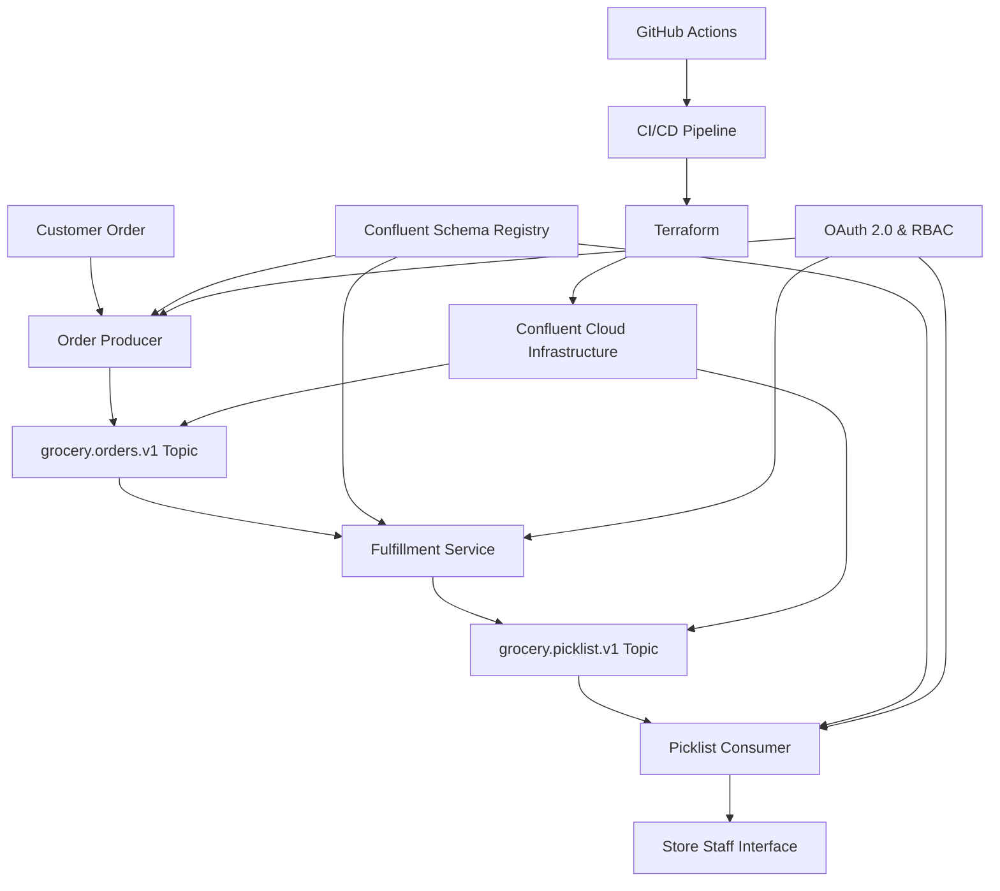

# Confluent Cloud Event-Driven Grocery Order Processing Demo


## 🎯 Overview

This project demonstrates a real-world **event-driven architecture** using **Confluent Cloud** for grocery order processing. It showcases how modern e-commerce platforms handle order fulfillment with microservices, implementing the complete flow from order placement to store fulfillment with enterprise-grade automation and infrastructure as code.

### 🏗️ Architecture



## 🚀 Use Case

**Real-time grocery order fulfillment system** powered by Confluent Cloud that processes customer orders and generates pick lists for store staff:

1. **Customer places order** → Mobile app sends order to Order API
2. **Order API publishes** → `grocery.orders.v1` topic on Confluent Cloud
3. **Fulfillment Service consumes** → Processes order and creates pick-and-pack tasks
4. **Fulfillment Service publishes** → `grocery.picklist.v1` topic with picking instructions
5. **Store devices consume** → Display pick lists to guide staff through aisles

## 🔧 Technical Implementation

### Core Components

| Component               | Purpose                                         | Topics                                                  |
| ----------------------- | ----------------------------------------------- | ------------------------------------------------------- |
| **Order Producer**      | Simulates customer orders from mobile app       | Writes to `grocery.orders.v1`                           |
| **Fulfillment Service** | Processes orders and creates pick lists         | Reads `grocery.orders.v1`, Writes `grocery.picklist.v1` |
| **Picklist Consumer**   | Simulates store devices receiving pick lists    | Reads `grocery.picklist.v1`                             |
| **Demo UI**             | Streamlit dashboard for monitoring all services | Visual interface for demo                               |

### Key Features

- ✅ **Confluent Cloud Integration** - Fully managed Kafka service with enterprise features
- ✅ **Avro Schema Management** - Strict data contracts with backward compatibility via Confluent Schema Registry
- ✅ **OAuth 2.0 Authentication** - Secure access control for producers/consumers
- ✅ **RBAC (Role-Based Access Control)** - Least-privilege security model
- ✅ **Event-Driven Architecture** - Loosely coupled microservices
- ✅ **Real-time Processing** - Immediate order-to-picklist transformation
- ✅ **Interactive Demo UI** - Live monitoring and control interface
- ✅ **Infrastructure as Code** - Terraform automation for Confluent Cloud resources
- ✅ **CI/CD Automation** - GitHub Actions for deployment and schema validation

## 📊 Data Flow & Schema Design

### Event Schemas

#### grocery.orders.v1 (Order Events)

```json
{
  "order_id": "uuid",
  "customer_id": "string",
  "items": ["apple", "banana", "milk"],
  "order_total": 45.67,
  "order_time": "2025-09-08 14:30:00"
}
```

#### grocery.picklist.v1 (Picklist Events)

```json
{
  "picklist_id": "uuid",
  "order_id": "uuid",
  "items_to_pick": ["apple", "banana", "milk"],
  "assigned_picker": "picker-123",
  "created_time": "2025-09-08 14:30:01"
}
```

## 🔒 Security & Access Control

### Identity Pools

- **grocery-producers** - Order API services
- **grocery-fulfillment** - Fulfillment services

### RBAC Permissions

| Pool                  | Read Access         | Write Access          | Schema Access                                 |
| --------------------- | ------------------- | --------------------- | --------------------------------------------- |
| `grocery-producers`   | -                   | `grocery.orders.v1`   | Read/Write order schema                       |
| `grocery-fulfillment` | `grocery.orders.v1` | `grocery.picklist.v1` | Read order schema, Read/Write picklist schema |

## 🛠️ Setup & Installation

### Prerequisites

- Python 3.8+
- **Confluent Cloud account** with Kafka cluster and Schema Registry enabled
- OAuth credentials for authentication
- (Optional) Terraform for infrastructure automation
- (Optional) GitHub Actions for CI/CD

### 1. Clone Repository

```bash
git clone https://github.com/JIBIN-VARGHESE/kafka-demo-app.git
cd kafka-demo-app
```

### 2. Install Dependencies

```bash
pip install -r requirements.txt
```

### 3. Configure Confluent Cloud Integration

Update the following files with your Confluent Cloud credentials:

**For Order Producer (`order_producer.py`):**

```python
BOOTSTRAP_SERVERS = "your-kafka-bootstrap-servers"
SCHEMA_REGISTRY_URL = "your-schema-registry-url"
OAUTH_TOKEN_URL = "your-oauth-token-url"
CLIENT_SECRET = "your-producer-client-secret"
```

**For Fulfillment Service (`fulfillment_service.py`):**

```python
BOOTSTRAP_SERVERS = "your-kafka-bootstrap-servers"
SCHEMA_REGISTRY_URL = "your-schema-registry-url"
OAUTH_TOKEN_URL = "your-oauth-token-url"
CONSUMER_CLIENT_SECRET = "your-consumer-client-secret"
PRODUCER_CLIENT_SECRET = "your-producer-client-secret"
```

**For Picklist Consumer (`picklist_consumer.py`):**

```python
BOOTSTRAP_SERVERS = "your-kafka-bootstrap-servers"
SCHEMA_REGISTRY_URL = "your-schema-registry-url"
OAUTH_TOKEN_URL = "your-oauth-token-url"
CLIENT_SECRET = "your-consumer-client-secret"
```

## 🎮 Running the Demo

### Option 1: Interactive Demo UI (Recommended)

```bash
streamlit run demo_ui.py
```

Open your browser to `http://localhost:8501` and use the visual interface to start/stop services.

### Option 2: Manual Service Start

Run each component in separate terminals:

```bash
# Terminal 1: Start Order Producer
python order_producer.py

# Terminal 2: Start Fulfillment Service
python fulfillment_service.py

# Terminal 3: Start Picklist Consumer
python picklist_consumer.py
```

## � CI/CD & Infrastructure Automation

### Infrastructure as Code with Terraform

This demo supports automated infrastructure provisioning using Terraform:

```hcl
# Example Terraform configuration for Confluent Cloud
resource "confluent_kafka_cluster" "grocery_cluster" {
  display_name = "grocery-order-processing"
  availability = "SINGLE_ZONE"
  cloud        = "AWS"
  region       = "us-west-2"
}

resource "confluent_kafka_topic" "orders" {
  kafka_cluster {
    id = confluent_kafka_cluster.grocery_cluster.id
  }
  topic_name    = "grocery.orders.v1"
  partitions_count = 3
}

resource "confluent_kafka_topic" "picklists" {
  kafka_cluster {
    id = confluent_kafka_cluster.grocery_cluster.id
  }
  topic_name    = "grocery.picklist.v1"
  partitions_count = 3
}
```

### GitHub Actions CI/CD Pipeline

Automated deployment and validation pipeline:

```yaml
name: Confluent Cloud Demo Pipeline

on:
  push:
    branches: [main]
  pull_request:
    branches: [main]

jobs:
  validate-schemas:
    runs-on: ubuntu-latest
    steps:
      - uses: actions/checkout@v3
      - name: Validate Avro Schemas
        run: |
          python -c "import avro.schema; avro.schema.parse(open('schemas/grocery_orders.avsc').read())"
          python -c "import avro.schema; avro.schema.parse(open('schemas/grocery_picklist.avsc').read())"

  terraform-plan:
    runs-on: ubuntu-latest
    steps:
      - uses: actions/checkout@v3
      - name: Setup Terraform
        uses: hashicorp/setup-terraform@v2
      - name: Terraform Plan
        run: |
          terraform init
          terraform plan
        env:
          CONFLUENT_CLOUD_API_KEY: ${{ secrets.CONFLUENT_CLOUD_API_KEY }}
          CONFLUENT_CLOUD_API_SECRET: ${{ secrets.CONFLUENT_CLOUD_API_SECRET }}

  deploy:
    needs: [validate-schemas, terraform-plan]
    runs-on: ubuntu-latest
    if: github.ref == 'refs/heads/main'
    steps:
      - name: Deploy to Confluent Cloud
        run: terraform apply -auto-approve
```

### Benefits of Automation

- **Schema Validation** - Prevent breaking changes with automated compatibility checks
- **Infrastructure Consistency** - Reproducible environments across dev/staging/prod
- **Security Compliance** - Automated RBAC policy application
- **Zero-Downtime Deployments** - Blue-green deployments with validation gates
- **Cost Optimization** - Automatic resource scaling and cleanup

## �📈 Monitoring & Observability

### Demo UI Features

- **Service Status** - Real-time status of all components
- **Live Logs** - Streaming logs from each service
- **Start/Stop Controls** - Easy service management
- **Event Flow Visualization** - See events flowing through the system

### Confluent Cloud Monitoring

Monitor your deployment in Confluent Cloud dashboard:

- **Topic Metrics** - Message throughput, partition distribution
- **Schema Registry** - Schema versions and compatibility
- **Consumer Lag** - Real-time lag monitoring per consumer group
- **Security Audit** - OAuth authentication logs and RBAC policy violations
- **Cost Analytics** - Usage-based billing insights

## 🏢 Enterprise Benefits

This demo showcases enterprise-grade capabilities:

### Scalability

- **Horizontal scaling** - Add more fulfillment service instances
- **Partitioned topics** - Distribute load across partitions
- **Consumer groups** - Parallel processing of orders

### Reliability

- **Message durability** - Kafka's replication ensures no data loss
- **Fault tolerance** - Services can restart and resume processing
- **Exactly-once semantics** - Prevent duplicate order processing

### Security

- **OAuth 2.0** - Industry-standard authentication
- **RBAC** - Fine-grained access controls
- **Schema validation** - Prevent malformed data

### Governance

- **Schema evolution** - Backward-compatible changes with Confluent Schema Registry
- **Audit trails** - Complete event history and compliance reporting
- **GDPR compliance** - Data retention policies and right-to-be-forgotten
- **Infrastructure as Code** - Version-controlled infrastructure changes
- **Automated compliance** - CI/CD validation of security policies

### Cloud-Native Benefits

- **Fully managed** - No infrastructure maintenance overhead
- **Global availability** - Multi-region disaster recovery
- **Auto-scaling** - Elastic scaling based on demand
- **Enterprise security** - SOC 2, ISO 27001, HIPAA compliance
- **Cost efficiency** - Pay-per-use pricing model

## 🔄 CI/CD Integration

The architecture supports GitOps workflows with any CI/CD platform:

### GitHub Actions Integration

```yaml
# Automated schema validation and deployment
- Schema compatibility testing with Confluent Schema Registry
- Infrastructure provisioning with Terraform
- Security policy validation
- Automated testing of producers/consumers
- Blue-green deployments with rollback capabilities
```

### Jenkins/GitLab CI Support

```yaml
# Alternative CI/CD platforms
- Pipeline templates for Jenkins, GitLab CI, Azure DevOps
- Confluent Cloud CLI integration
- Terraform state management
- Multi-environment promotion workflows
```

### DevOps Best Practices

- **GitOps** - Infrastructure and configuration as code
- **Immutable deployments** - Container-based application delivery
- **Feature flags** - Safe feature rollouts with instant rollback
- **Automated testing** - Unit, integration, and end-to-end testing
- **Security scanning** - Vulnerability assessment in CI pipeline

## 📚 Learning Outcomes

This project demonstrates:

- **Event-driven architecture** patterns with Confluent Cloud
- **Apache Kafka** producer/consumer implementation
- **Confluent Schema Registry** for Avro schema management
- **OAuth 2.0 & RBAC** security implementation
- **Microservices** communication patterns
- **Real-time data processing** workflows
- **Streamlit** application development
- **Infrastructure as Code** with Terraform
- **CI/CD automation** with GitHub Actions
- **Cloud-native development** practices

## 🤝 Contributing

1. Fork the repository
2. Create a feature branch (`git checkout -b feature/amazing-feature`)
3. Commit your changes (`git commit -m 'Add amazing feature'`)
4. Push to the branch (`git push origin feature/amazing-feature`)
5. Open a Pull Request

## 📄 License

This project is licensed under the MIT License - see the [LICENSE](LICENSE) file for details.

## 👨‍💻 Author

**Jibin Varghese**

- GitHub: [@JIBIN-VARGHESE](https://github.com/JIBIN-VARGHESE)
- LinkedIn: [Connect with me](https://linkedin.com/in/jibin-varghese)

## ⭐ Show Your Support

If this project helped you understand Kafka and event-driven architectures, please give it a star! ⭐

---

_Built with ❤️ for demonstrating enterprise-grade event streaming with Confluent Cloud and modern DevOps practices_
